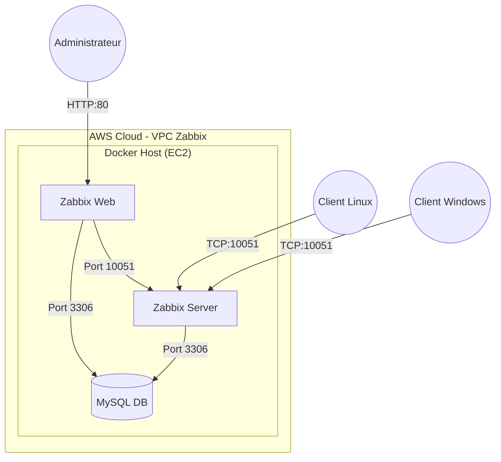

# 📊 Déploiement d'une Infrastructure de Supervision Zabbix sur AWS


---

##  Introduction

Ce projet présente le déploiement complet d’une solution de supervision Zabbix conteneurisée sur le cloud AWS. L’objectif principal est de mettre en place une surveillance proactive et centralisée des infrastructures informatiques, qu’elles soient basées sur Linux ou Windows.

Ce dépôt accompagne le rapport de projet réalisé par Boubker Cheyoukh et regroupe l’ensemble des fichiers de configuration, scripts et ressources nécessaires pour reproduire l’infrastructure de supervision dans un environnement AWS.

###  Objectifs
*   **Surveillance hybride : Superviser des instances Ubuntu et Windows Server.

**Conteneurisation : Déployer Zabbix à l’aide de Docker Compose afin de garantir portabilité et simplicité.

**Cloud AWS : Exploiter une infrastructure fiable basée sur EC2, VPC et Security Groups.

**Automatisation : Faciliter et accélérer le déploiement de la solution de monitoring.
---

##  Table des Matières
1.  [Architecture Réseau & Flux](#-architecture-réseau--flux)
2.  [Mise en place de l'Infrastructure AWS](#-mise-en-place-de-linfrastructure-aws)
3.  [Installation du Serveur Zabbix (Docker)](#-installation-du-serveur-zabbix-docker)
4.  [Installation et Configuration des Agents](#-installation-et-configuration-des-agents)
5.  [Supervision & Résultats](#-supervision--résultats)
6.  [Contenu du Dépôt](#-contenu-du-dépôt)

---

##  Architecture Réseau & Flux

L'infrastructure repose sur un VPC AWS dédié avec une segmentation claire.

### Schéma Logique



### Composants
1.  **Serveur Zabbix** : Orchestrateur central (Dockerisé).
2.  **Base de Données** : MySQL 8.0 pour le stockage des métriques.
3.  **Interface Web** : Nginx pour la visualisation.
4.  **Agents** : Services installés sur les machines clientes.

---

## ☁️ Mise en place de l'Infrastructure AWS

### 1. Choix de la Région
Sélection d'une région AWS (ex: **us-east-1**) pour minimiser la latence.

### 2. Configuration Réseau (VPC)
*   **VPC** : `10.0.0.0/16` pour isoler l'infrastructure.
*   **Subnet Public** : Pour l'accès Internet.
*   **Internet Gateway** : Routage du trafic sortant.

### 3. Sécurité (Security Groups)
Ports autorisés :
*   **SSH (22)** : Administration.
*   **HTTP (80)** : Interface Web Zabbix.
*   **Zabbix Agent (10051)** : Flux de monitoring.

### 4. Instances EC2
| Rôle | OS | Type | Usage |
| :--- | :--- | :--- | :--- |
| **Zabbix Server** | Ubuntu 22.04 | t3.large | Héberge Docker & Zabbix |
| **Client Linux** | Ubuntu 22.04 | t3.medium | Cible à monitorer |
| **Client Windows** | Windows Server 2022 | t3.large | Cible à monitorer |

---

##  Installation du Serveur Zabbix (Docker)

### 1. Prérequis
*   Accès SSH à l'instance serveur.
*   Git installé (optionnel).

### 2. Installation de Docker
```bash
sudo apt update
sudo apt install -y docker.io docker-compose
sudo systemctl enable --now docker
sudo usermod -aG docker ubuntu
```

### 3. Déploiement de la Stack
Le fichier [docker-compose.yml](./docker-compose.yml) définit les services.

```bash
# Lancer la stack en arrière-plan
docker-compose up -d
```

### 4. Accès Web
*   URL : `http://<IP-PUBLIQUE>`
*   Credentials par défaut : `Admin` / `zabbix`

---

## 🔧 Installation et Configuration des Agents

### Client Linux (Ubuntu)
```bash
sudo apt install -y zabbix-agent
# Editer /etc/zabbix/zabbix_agentd.conf : Server=<IP_SERVEUR>
sudo systemctl restart zabbix-agent
```

### Client Windows
1.  Installer le MSI Zabbix Agent.
2.  Configurer l'IP du serveur Zabbix.
3.  Ouvrir le port **10051** (Firewall).

---

##  Supervision & Résultats

Une fois configurés, les agents remontent les métriques (CPU, RAM, Disque) vers le serveur.
*   **Statut ZBX** : Doit être vert dans l'interface.
*   **Graphiques** : Générés automatiquement pour l'analyse.

---

##  Contenu du Dépôt

Ce dépôt contient l'ensemble des ressources techniques :

*   [`docker-compose.yml`](./docker-compose.yml) : Définition de la stack Docker (Server, Web, DB).
*   [`architecture_reseau.drawio`](./architecture_reseau.drawio) : Schéma d'architecture éditable.
*   [`img/`](./img/) : Dossier contenant les captures d'écran (référencées dans le rapport).
*   `.env` : Fichier de variables d'environnement (exclure les secrets en prod).

---

##  Auteur

**Hamada Faris**
*   Projet : Supervision Réseau & Cloud
*   Technos : Zabbix, Docker, AWS

---
*Document généré pour accompagner le rapport de projet.*
